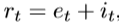
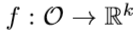
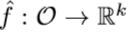
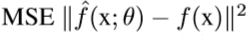
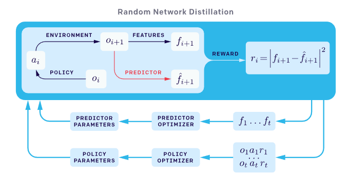
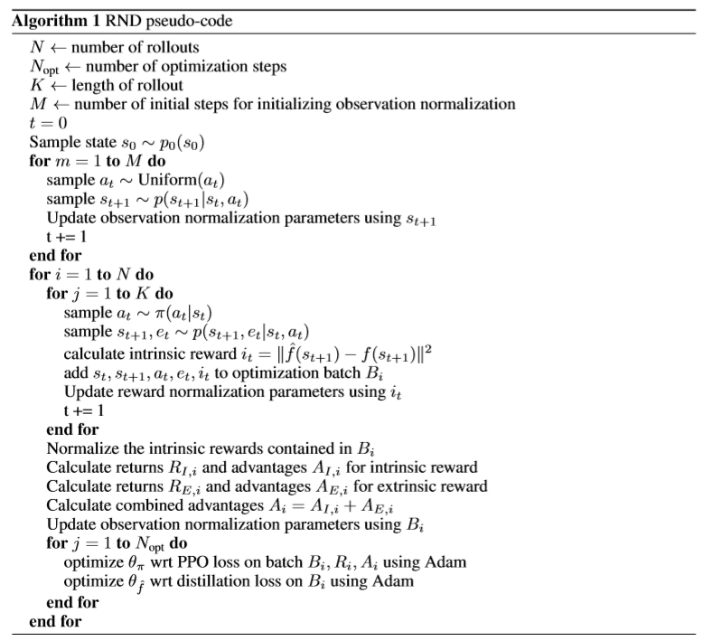

# -Review-Random-Network-Distillation
> https://arxiv.org/abs/1810.12894
> https://bluediary8.tistory.com/37

[Review &amp; Implementation]

[Summary]
RND 논문은 Deep reinforcement learning을 통해 Agent를 학습할 때 적은 computation overhead로 exploration bonus를 줄 수 있는 방법을 소개하는 논문입니다. Explration bonus 라는 개념을 Intrinsic reward로 표현하며 이를 fixed randomly initialized neural network가 예측한 state feature와 실제 state feature의 오차로 정의 하였습니다. RND 기법이 가지는 장점을 다음과 같이 얘기하였습니다.  
1. 기존에 존재하는 RL 기법들에 모두 적용이 가능  
2. single forward 계산을 통해서 Intrinsic reward를 계산
3. high-dimensional observation에 효과적

[Method]
**Exploration Bonus**  
기존의 환경에서 주는 reward rt를 아래 그림과 같이 intrinsic reawrd it 를 더하는 것으로 대체합니다.  
  
이때, Exploration Bonus는 Agent가 기존에 방문한적 없는 State에 도달 할 수 있도록 만드는 것이 목적이므로 기존에 방문했던 State에 도달하였을 때 보다 새로운 State에 도달하면 높은 값을 주도록 해야 합니다.  
환경을 크게 2가지로 나누어서 논문에서는 이전 연구들에 대해서 설명합니다.  
1. Tabular Setting : State의 수가 finite 하기 때문에 state 별로 방문했던 횟수를 count하고 방문 횟수가 늘어날 수록 intrinsic reward가 줄어드는 함수를 설정  
2. Non-Tabular Setting : State 를 대부분 한 번만 방문하기 때문에 방문했던 횟수에 대한 count는 적절하지 못합니다. 그러므로, state density esimation의 변화를 instrinsic reward로 사용하는 방법 (Reference : Marc Bellemare, Sriram Srinivasan, Georg Ostrovski, Tom Schaul, David Saxton, and Remi Munos. Unifying count-based exploration and intrinsic motivation. In NIPS, 2016.)  

**Random Network Distillation**  
이 논문에서 제시하는 방법인 RND는 다음과 같이 2가지 neural network를 활용합니다.  
1. a fixed and randomly initialized target network.   

2. a predictor network trained on data collected by the agent.   

이때, predictor network는 MSE 를 최소화하는 방향으로 학습을 하여 새로운 state를 만나게 되었을 때 prediction error가 큰 network가 되도록 합니다.

**Source of Prediction Errors**
이 논문에서는 이런 Prediction error가 발생하는 요소에 대해서 다음과 같이 정리합니다.  
1. Amount of training data : predictor에 의해서 몇번 경험하지 못한 경우
2. Stochasticity : target function 이 stochastic 이기 때문에 예측의 불확실성이 높은 경우
3. Model misspecification : 예측에 필요한 necessary information 이 부족하거나 the model class가 the complexity of the target function을 충족시키기에 부족한 경우.
4. Learning dynamics : predictor가 학습과정에서 target function을 근사하는 것에 실패한 경우

이 중 1번째 요소는 exploration bonus로 활용할 수 있습니다. 실제로 prediction error가 발생하는 이유는 위의 요소들의 종합적인 이유이지만 모든 요소가 bonus로 여기기에 좋지는 않습니다. 
2번 요소의 경우 'noisy-TV' 문제로 유명한 문제이며 2번과 3번 요소를 해결하기 위해서 새로운 데이터 포인트를 볼 때 예측 모델이 얼마나 향상되는지 측정하는 연구 방법들이 있었으나 계산 측면에서 효율적이지 못하였습니다. (Reference : Schmidhuber (1991a); Oudeyer et al. (2007); Lopes et al. (2012); Achiam & Sastry (2017) )  

**COMBINING INTRINSIC AND EXTRINSIC RETURNS**
이 논문에서는 "non-episodic"이라는 표현으로 환경에서의 reward없이 intrinsic reward만을 가지고 학습한 경우를 정의합니다.  
이때, Agent가 얻는 intrinsic reward는 모든 에피소드에서 발생하는지 또는 여러 에피소드에 퍼져있는지에 관계없이 새롭게 도달하게 되는 State 라는 정보에만 영향을 받게 됩니다. 이런 non-episodic intrinsic reward가 효과적이라는 예시로 episodic intrinsic reward와 같이 episode마다 구분을 하게 된다면 "gameover"라는 정보에 의해서 때로는 Agent가 학습할 정보가 사라질 수 있다고 말합니다.
그러나, intrinsic reward 만을 사용하는 것에도 게임의 시작 부분에 가까운 보상을 찾아 고의적으로 게임을 계속 다시 시작하는 행동을 반복하는 것과 같은 잘못된 학습이 이루어질 수 있습니다. 그러므로, Intrinsic reward와 extrinsic reward를 적절히 섞어 주는것이 exploration을 위해서 적합할 수 있다고 얘기합니다.

**REWARD AND OBSERVATION NORMALIZATION**
exploration reward로 prediction error를 사용하는 것과 관련된 한 가지 문제점은 reward의 scale이 다른 환경과 다른 시점에서 크게 다를 수 있으므로 모든 환경/설정에서 효과적인 hyperparameter를 찾는것이 어렵다는 것입니다. 이 논문에서는 Continuos control 문제에서 자주 사용하는 방법으로 Standard deviation과 Mean 값을 빼고 나누는 방법으로 intrinsic reward를 normalization 합니다. 그와 함께 Observation normalization 방법도 사용하며 observation normalization은 -5 ~ +5 로 clip을 수행합니다. ( subtracting the running mean and then dividing by the running standard deviation. )

**Algorithm**

> https://bluediary8.tistory.com/37 에서 참조하였습니다!  

RND는 t timestep 에서 Agent의 action에 의해서 변화된 next state에 대해 feature를 추출합니다. 랜덤으로 가중치를 초기화시키고 고정시킨 target network는 계속해서 같은 state에 대해 같은 feature의 추출을 해주기만 하면 되기 때문에 학습이 필요없어집니다. 어차피 비슷한 state에 대해서는 비슷한 output feature를 내뱉게 됩니다. Target network의 output을 predictor network로 학습을 시키면 결국 predictor network는 target network와 비슷한 모델이 되어갑니다. 하지만 episode 과정중에 계속 보왔던 state에 대해 학습이 되기 때문에, 이전에 보왔던 state에 대해서 overfitting되게 되고, 보지 않았던 새로운 state를 보게 된다면, target network의 output과는 조금 다른 output을 내게 됩니다. 즉, 새로운 state를 찾아가면서 하는 행동에 대해서는 reward를 많이 줄수 있게 되는 것이죠. (이때, predictor network와 target network가 완전히 동일하게 되서 무조건 같은 output을 내지 않을까하는 의문이 들수도 있습니다만, MNIST데이터를 학습시키는 CNN모델만 생각해도 완전히 overfitting되는 열개의 모델을 만들어도 각기 NN의 weight는 다르다 라는 것을 생각해보면 직관적으로 절대 같아질수 없다라는 것을 이해할 수 있습니다.

